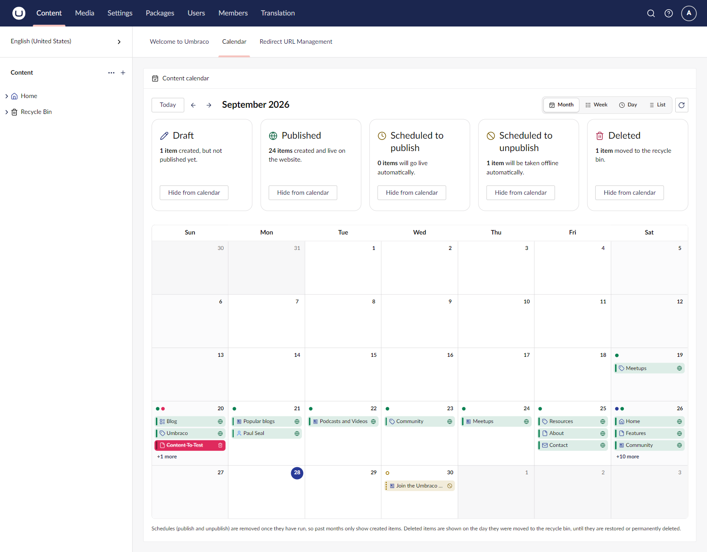
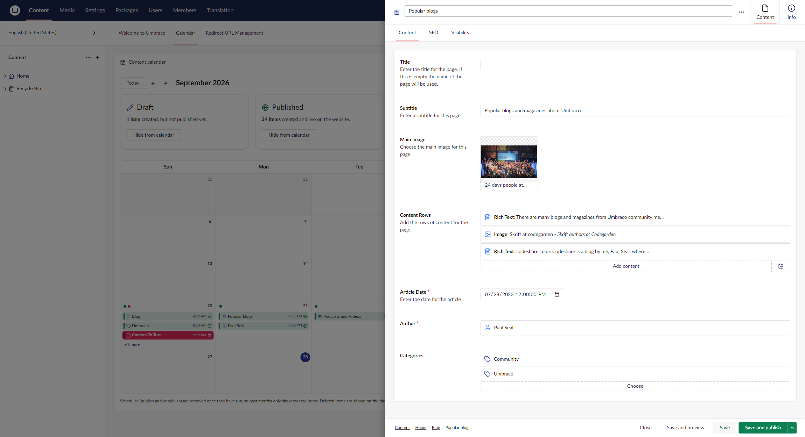
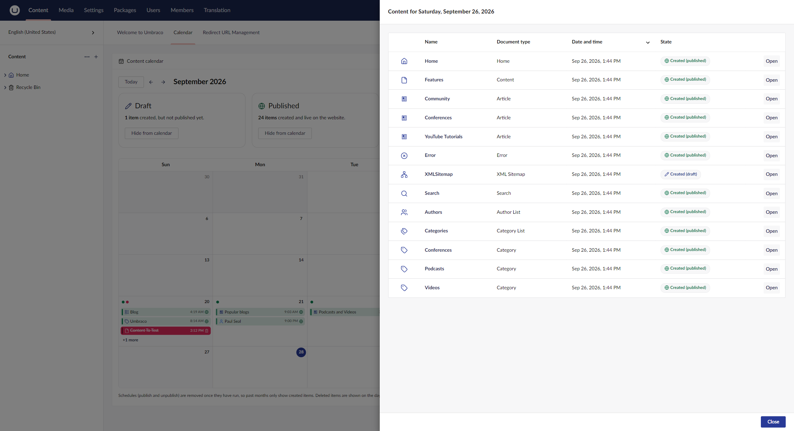
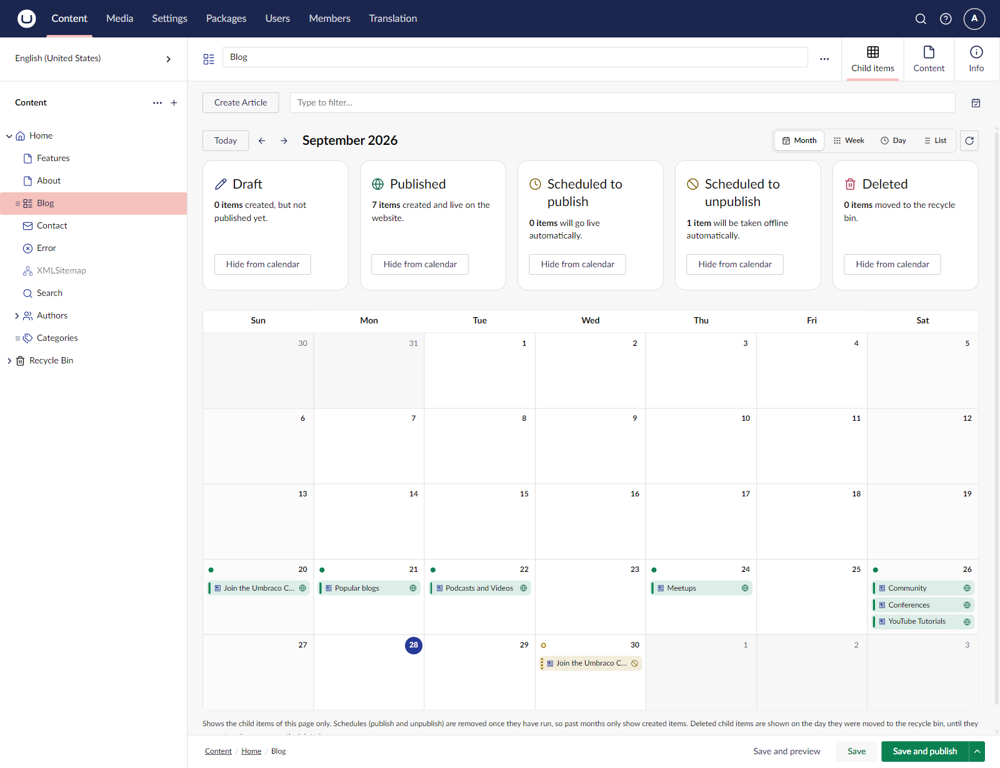

# 📅 Content Calendar For Umbraco 17+

**See what happens to your content, day by day, right inside the Umbraco backoffice!**

Content Calendar shows which pages were **created**, are **scheduled to publish** or **scheduled to unpublish**, and were **deleted**, in a calendar that looks and feels like Umbraco itself. Use it as a dashboard in the Content section, or as a **Calendar** view for the child items of any page.

[](https://github.com/ZAAKS/ContentCalendar/actions/workflows/build.yml)
[](https://github.com/ZAAKS/ContentCalendar/actions/workflows/release-v17.yml)
[](https://github.com/ZAAKS/ContentCalendar/actions/workflows/release-v18.yml)

| Package | NuGet |
| ------- | ----- |
| ContentCalendar.V17 | [](https://www.nuget.org/packages/ContentCalendar.V17) [](https://www.nuget.org/packages/ContentCalendar.V17) |
| ContentCalendar.V18 | [](https://www.nuget.org/packages/ContentCalendar.V18) [](https://www.nuget.org/packages/ContentCalendar.V18) |



---

## ✨ Features

### 🗓️ **Calendar Dashboard**
A **Calendar** tab in the Content section dashboard with **Month**, **Week**, **Day** and **List** views. Jump back to **Today** or move through months with the arrows.

### 🎨 **Colour-Coded States**
Every state has its own colour and icon, so you can see at a glance what is going on:
- ✏️ **Draft**: created, but not published yet
- 🌐 **Published**: created and live on the website
- ⏰ **Scheduled to publish**: will go live automatically
- 🚫 **Scheduled to unpublish**: will be taken offline automatically
- 🗑️ **Deleted**: moved to the recycle bin

### 🧮 **Summary Tiles**
One tile per state shows how many items there are in the current period, for example *"1 item created, but not published yet."* Use the **Hide from calendar** button on a tile to hide or show that state.

### ✍️ **Infinite Editing**
Click an item in the calendar and it opens in a side drawer, just like the content picker. Edit, save and publish without leaving the calendar; the calendar refreshes when you close the drawer.



### 📋 **Busy Days at a Glance**
When a day has more items than fit in the cell, click **+N more** to open a list of everything on that day, with document type, date and time, and state. Click **Open** to edit an item.



### 📂 **Child Items Calendar**
Add **Content Calendar** as a layout to any Collection data type and a **Calendar** view appears next to the Grid and List views in **Child items**. It shows the child items of that page only.



### 🔒 **Respects Permissions**
Users only see content they have access to (start nodes and browse permissions). Deleted items are only shown to users with access to the content root, the same rule as the recycle bin.

### ♿ **Accessible and Native**
Built with Umbraco's own UI library, so it follows the backoffice look, keyboard navigation and screen reader support.

---

## 📦 Installation

Install the package that matches your Umbraco version:

| Umbraco version | Package |
| --------------- | ------- |
| 17.x | `ContentCalendar.V17` |
| 18.x | `ContentCalendar.V18` |

### Using .NET CLI

```bash
# Umbraco 17
dotnet add package ContentCalendar.V17

# Umbraco 18
dotnet add package ContentCalendar.V18
```

### Using NuGet Package Manager

```bash
# Umbraco 17
Install-Package ContentCalendar.V17

# Umbraco 18
Install-Package ContentCalendar.V18
```

### Using Visual Studio

1. Right-click on your project in Visual Studio
2. Click "Manage NuGet Packages..."
3. Click the "Browse" tab
4. Search for: `ContentCalendar.V17` (Umbraco 17) or `ContentCalendar.V18` (Umbraco 18)
5. Click "Install"

### Requirements

- Umbraco CMS **17.2** or later (17.x) with `ContentCalendar.V17`, or Umbraco CMS **18.0** or later (18.x) with `ContentCalendar.V18`
- .NET **10**

No database migrations, no extra tables: the calendar reads the data Umbraco already stores.

---

## ⚙️ Configuration

Content Calendar works out of the box. All settings are optional.

### Step 1: Configure `appsettings.json` (optional)

#### Example

```json
{
  "ContentCalendar": {
    "MaxEntriesPerKind": 2000,
    "ShowDeleted": true,
    "ShowScheduledUnpublish": true
  }
}
```

#### Default values (if you skip a key)

| Setting | Default |
| ------- | ------- |
| **MaxEntriesPerKind** | `2000` |
| **ShowDeleted** | `true` |
| **ShowScheduledUnpublish** | `true` |

#### Settings explained

- **MaxEntriesPerKind**: Safety cap on how many items of each state are loaded for one period. Protects the backoffice after bulk imports.
- **ShowDeleted**: `true` = show items in the recycle bin on the day they were deleted; `false` = hide deleted items.
- **ShowScheduledUnpublish**: `true` = show pending "Unpublish at" schedules on their date; `false` = hide them.

---

### Step 2: Add the calendar to Child items (optional)

1. Go to **Settings → Data Types**
2. Open the **Collection** data type your document type uses (for example *List View - Content*)
3. Under **Layouts**, click **Choose**, pick **Content Calendar** and click **Save**
4. Open a page that uses that data type, go to **Child items** and switch to **Calendar**

---

### Step 3: Start Using It!

1. **Start your Umbraco website** (press F5 in Visual Studio)
2. **Log in** to the Umbraco backoffice
3. Open the **Content** section
4. Click the **Calendar** dashboard tab
5. Switch between **Month**, **Week**, **Day** and **List**
6. Click an item to edit it in the side drawer ✨

> **Note:** Umbraco removes a schedule once it has run, so past months only show created (and deleted) items. Upcoming schedules are shown on the day they will run.

---

## 🐛 Issues & Support

Found a bug or have a suggestion? We'd love to hear from you!

👉 **Report Issues**: [GitHub Issues](https://github.com/ZAAKS/ContentCalendar/issues)

When reporting an issue, please include:
- What you expected to happen
- What actually happened
- Error messages (if any)
- Your Umbraco and Content Calendar versions
- Steps to reproduce

---

## 📜 License

This project is licensed under the MIT License - see the [LICENSE](LICENSE) file for details.

---

## 🙏 Acknowledgments

Built with:
- ❤️ Love for the Umbraco community
- 📆 [FullCalendar](https://fullcalendar.io/) and the [Umbraco UI Library](https://uui.umbraco.com/)
- ☕ Lots of coffee

---

**Happy planning! 🎉**

*Made with ❤️ for the Umbraco community by [ZAAKS!](https://www.zaaks.nl/)*
